<!--
    To generate the readme, run:

    docker run -ti --rm -v /Users/ksb/calculus_of_constructions:/test/usr maltegruber/readme-tex:1.0.0;

    see: https://github.com/MalteGruber/readme-tex

-->

# calculus_of_constructions

## Background: What is CoC

The CoC provides a language with which we can express mathematical _terms_ (e.g. , , 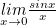) and _types_ (e.g. the real numbers , the type of functions , the type of lists of length  - note, it also turns out each type is itself a term of some other type).

The basic CoC syntax describes how to construct _pseudoterms_, which will represent types and terms (although some may be nonsensical).

- Variables, e.g. 
- Lambda abstractions, which describe functions that substitute a variable into a body expression, e.g. the doubling function 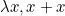 or the identity function  or a function which takes two arguments and applies the first to the second 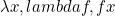.
- Pi types, which represent the types of functions (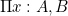 refers to the type of functions that take a term of type  and return a term of type  (which may or may not depend on the value of the input, )). E.g. 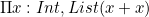 accepts integers and returns elements of the type of lists of length 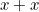. Often there's no dependence on the  at all, so we abbreviate with notation .
- The word _sort_ refers to the type of a type. In the flavor of CoC we implement here, we have as axioms the existence of two 'ground level' sorts 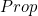 and 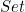 as well as an infinite sequence higher order 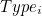 for any natural number .

The power of the CoC comes from a set of accompanying rules which allow us to construct terms of a certain type, i.e. prove that a term has a certain type. These rules capture the meanings of the symbols described above, so that we can prove things like 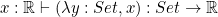 (a lambda expression which accepts a set , ignores it and returns a constant  of type  has the type of ).

## Why is it interesting

If the basic thing we can do is show that term 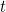 has type , it may be confusing as to what's the interest in this language at all, since the fact that  or  are not too remarkable. What we care about are more elaborate _propositions_ we can make about these mathematical terms, such as:

- ,
- or more abstract things, e.g. :for the type of pairs of  there exists a _unique_ pair of projection functions  such that for _any_ pair of functions , there is a unique map  such that  and  (i.e. one can always _factor_ out a  component from the functions). With the right interpretations, we can consider proofs that a certain compiler optimization does not alter the meaning of the unoptimized code or that a critical piece of code has no bugs.

It turns out our simple typing judgments are capable of proving such kinds of sweeping mathematical statements, due to a remarkable correspondance (called the Curry Howard Isomorphism) between the above language and the language of logic. Logical operations such as _and_, _or_, _for all_, _not_, etc. each have analogues which interact identically. Other than learning the exact translations for each of these operations, the key insight is to think of propositions as a type (called ) that can have terms which are proofs of that proposition. Two example translation: the logical relation  ( _and_ ) can be proved if and only if we have a proof of  and a proof of , which is tantamount to having a term of the type of pairs . Likewise, the logical relation  (_if_ , _then_ ) is tantamount to a function type 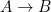, which provides a proof of  if you feed it a proof of .

Continuing in this fashion, we can represent arbitrarily complex statements about arbitrarily complex mathematical structures and have a computer mechanically verify (_finding_ the proof terms is not a step that can be fully automated, though this is a field of active research).

## Inductive types

In this repo, we use some common extensions of CoC to make it more usable, most notably adding inductive types.

## Functionality

This repo has implementations in different languages.

|                    Language                    |           Python            |         Haskell          |
| :--------------------------------------------: | :-------------------------: | :----------------------: |
|                 Run test suite                 | ✅  Run `pytest test.py` | ✅   Run `stack test` |
| Judge/typecheck pseudoterms to determine types |             ✅              |            ❌            |
|         Evaluate/β-reduce expressions          |             ✅              |            ❌            |
|  Pretty print and parse files of expressions   |             ✅              |            ❌            |

## References

1. TODO
