<!--
    To generate the readme, run:

    docker run -ti --rm -v /Users/ksb/calculus_of_constructions:/test/usr maltegruber/readme-tex:1.0.0;

    see: https://github.com/MalteGruber/readme-tex

-->

# calculus_of_constructions

## Background: What is CoC

The CoC provides a language with which we can express mathematical _terms_ (e.g. , , ) and _types_ (e.g. the real numbers , the type of functions 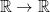, the type of lists of length  - note, it also turns out each type is itself a term of some other type).

The basic CoC syntax describes how to construct _pseudoterms_, which will represent types and terms (although some may be nonsensical).

- Variables, e.g. 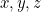
- Lambda abstractions
  - describe functions that substitute a variable into a body expression, e.g.:
    - the doubling function 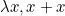
    - the identity function 
    - a function which takes two arguments and applies the first to the second: 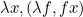.
- Pi types
  - represent the types of functions
  - 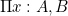 refers to the type of functions that take a term of type  and return a term of type  (which may or may not depend on the value of the input, )). E.g.:
    -  accepts integers and returns elements of the type of lists of length 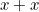.
  - Often there's no dependence on the  at all, so we abbreviate with notation .
- The word _sort_ refers to the type of a type. In the flavor of CoC we implement here, we have as axioms the existence of two 'ground level' sorts  and , as well as an infinite sequence higher order 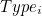 for any natural number .

The power of the CoC comes from a set of accompanying rules which allow us to construct terms of a certain type, i.e. prove a judgment that a term has a certain type (and that the term is well-formed). Notationally we write this as 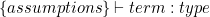. These rules capture the meanings of the symbols described above, so that we can prove things like  (i.e. a lambda expression which accepts a set but ignores it and returns a constant  of type  has the type of ).

## Why is it interesting

If the basic thing we can do is show that term  has type , it may be confusing as to what's the interest in this language at all, since the fact that 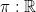 or 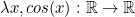 are not too remarkable. What we care about are more elaborate _propositions_ we can make about these mathematical terms, such as:

- 
- for the type of _pairs_ of 
  - there exists a _unique_ pair of projection functions  such that for _any_ pair of functions 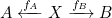, there is a unique map  such that  and  (i.e. one can always _factor_ out a  component from the functions).
- A certain compiler optimization does not alter the meaning of the unoptimized code, or a critical piece of code has no bugs.

It turns out our simple typing judgments _are_ capable of proving such kinds of sweeping mathematical statements, due to a remarkable correspondance (called the [Curry Howard Isomorphism](https://en.wikipedia.org/wiki/Curry%E2%80%93Howard_correspondence)) between the above language and the language of logic. Logical operations such as _and_, _or_, _for all_, _not_, etc. each have analogues which behave just as they do in logic.

- Other than learning the exact translations for each of these operations, the key insight is to think of propositions as a type (called ) that can have terms which are proofs of that proposition.
- The logical relation  ( _and_ ) can be proved if and only if we have a proof of  and a proof of , which is tantamount to having a term of the type of pairs .
- The logical relation  (_if_ , _then_ ) is tantamount to a function type , which provides a proof of  if you feed it a proof of .

Continuing in this fashion, we can represent arbitrarily complex statements about arbitrarily complex mathematical structures and have a computer mechanically verify (_finding_ the proof terms is not a step that can be fully automated, though this is a field of active research).

## Inductive types

In this repo, we use some common extensions of CoC to make it more usable, most notably adding inductive types.

## Functionality

This repo has implementations in different languages.

|                    Language                    |           Python            |         Haskell          |
| :--------------------------------------------: | :-------------------------: | :----------------------: |
|                 Run test suite                 | ✅  Run `pytest test.py` | ✅   Run `stack test` |
| Judge/typecheck pseudoterms to determine types |             ✅              |            ❌            |
|         Evaluate/β-reduce expressions          |             ✅              |            ❌            |
|  Pretty print and parse files of expressions   |             ✅              |            ❌            |

## References

1. TODO
