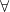
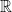

<!--
    To generate the readme, run:

    docker run -ti --rm -v /Users/ksb/calculus_of_constructions:/test/usr maltegruber/readme-tex:1.0.0;

    see: https://github.com/MalteGruber/readme-tex

-->


# calculus_of_constructions

## Background: What is CoC

The CoC provides a language with which we can express mathematical _terms_ (e.g. , , ) and _types_ (e.g. pairs of real numbers , the type of functions , the type of lists of length ).

The basic CoC syntax describes how to construct _pseudoterms_, which will represent types and terms.

- Variables, e.g. 
- Applying a function to a term, e.g. `f(x)` (often written without parentheses, e.g. `plus n m`)
- Lambda abstractions
  - describe functions that substitute a variable into a body expression, e.g.:
    - the doubling function 
    - the identity function 
    - a function which takes two arguments and applies the first to the second: .
- Pi types
  - represent the types of functions
  -  refers to the type of functions that take a term of type  and return a term of type  (which may or may not depend on the value of the input, )). E.g.:
    -  accepts integers and returns elements of the type of lists of length .
  - Often there's no dependence on the  at all, so we abbreviate these cases with notation .
  - Given the meaning of , it is often written as  (which means "for all").
- The word _sort_ refers to the type of a type. In the flavor of CoC we implement here, we have as axioms the existence of two 'ground level' sorts  and , as well as an infinite sequence higher order sorts  for any natural number .

The power of the CoC comes from a set of accompanying rules which allow us to construct terms of a certain type. This firstly allows us to show that a term is not nonsense, e.g. treating a natural number as a function: . Furthermore, we can prove judgments saying a term has a certain type. Notationally we write this as . These judgment-forming rules (described in the references below) capture the meanings of the symbols described above, so that we can prove things like:

- 
- i.e. a lambda expression which accepts a set but ignores it and returns a constant  of type  has the type of .

## Why is it interesting

If the only thing we can do is show that term  has type , it may be confusing as to what's the interest in this language at all, since the fact that  or  aren't that remarkable. What we care about are more elaborate _propositions_ we can make about these mathematical terms, such as:

- 
- for the type of _pairs_ of 
  - there exists a _unique_ pair of projection functions  such that for _any_ pair of functions , there is a unique map  such that  and  (i.e. one can always _factor_ out a  component from the functions).
- After encoding the relevant real-world entities into the CoC, we might want to prove certain compiler optimization does not alter the meaning of the unoptimized code, or that a critical piece of code has no bugs.

It turns out our simple typing judgments _are_ capable of proving such kinds of elaborate mathematical statements, due to a remarkable correspondance (called the [Curry Howard Isomorphism](https://en.wikipedia.org/wiki/Curry%E2%80%93Howard_correspondence)) between the above language and the language of logic. Logical operations such as _and_, _or_, _for all_, _not_, etc. each have analogues which behave just as they do in logic.

- Other than learning the exact translations for each of these operations, the key insight is to think of _propositions as types_ with _terms as proofs_ of that proposition.
- The logical relation  ( _and_ ) can be proved if and only if we have a proof of  and a proof of , which is tantamount to having a term of the type of pairs .
- The logical relation  (_if_ , _then_ ) is tantamount to a function type , which provides a proof of  if you feed it a proof of .

Continuing in this fashion, we can construct arbitrarily complex statements about arbitrarily complex mathematical structures and have a computer mechanically verify them. _Discovering_ these proof terms is not a step that can be fully automated, though this is a field of active research.

## Inductive types

In this repo, we use some common extensions of CoC to make it more usable, most notably adding inductive types.

Although booleans, natural numbers, and other types _can_ be defined (called the Church encoding) with the above infrastructure, inductive types allow for an efficient and intuitive representation. A term of an inductive type must be constructed by one of its custom constructors and eliminated by case analysis (e.g. a function `I -> X` for some inductive type `I` must be defined for all possible constructors of `I`). These are easiest explained through examples (which can be found in `data/base.txt`):

The type of Booleans, `Bool`, can be modeled as an inductive type - i.e. something that is either `true` or `false`.

```
Inductive Bool : Set :=
| tt : Bool
| ff : Bool.
```

The natural numbers are a prototypical example of inductive types, as any element of it is either zero or the successor to another natural number (thus, `zero` lets us constructor a `Nat` in any context, and the `succ` constructor behaves like a function of type `Nat → Nat`).

```
Inductive Nat : Set :=
| zero : Nat
| succ : Nat → Nat.
```

`Lists` and `vectors` force us to consider inductive types that have a parameter, i.e. `List` itself isn't a type but rather must be applied to some parameter (in this case, `A`, an arbitrary `Type`) to form a type. All of the constructors implicitly require this parameter too, in addition to other arguments (`nil B` lets us construct an empty `List B`, while an element `c:C` can be added to a list `l_c:List C` by calling `cons C c l_c` which produces another element of type `List C`).

```
Inductive List (A: Type) : Type :=
| nil : List A
| cons : A → List A → List A.
```

`Vectors` work very similarly, but keep track of how long the length of the list is at the type level (the `Vnil X` case is forced to be of type `vector X 0` rather than any other number, and `Vcons` will always increment the type-level counter each time an element is appended).

```
Inductive vector (A: Type) : (Nat → Type) :=
| Vnil : vector A zero
| Vcons : A → vector A n → vector A (succ n).
```

We now introduce the basics of "propositions as types" (which are distinct from the encoding of `true` and `false` as _values_ of type `Bool`). We model the _proposition_ `True` (AKA `⊤`/`Unit`/`()`) as an inductive type with a single constructor. In _any_ context we are justified in producing a term of this type, reflecting how trivial it is to 'prove' `True`.

```
Inductive True : Prop :=
| true_mk : True.
```

We model `False` (`⟂`/`Void`) as an inductive type with no constructors. It is not possible to construct a term of this type (i.e. _prove_ `False`) without being in a trivial context that can prove anything (this allows us to model `Not A` as `A -> False`, meaning `A` is absurd enough to prove anything).

```
Inductive False : Prop :=.
```

There are two constructors for `Or A B` to reflect _either_ a proof of `A` or a proof of `B` is sufficient to prove the disjunction, while `And A B` works as described above.

```
Inductive OR (A: Prop) (B: Prop) : Prop :=
| inl : A → OR A B
| inr : B → OR A B.

Inductive AND (A: Prop) (B: Prop) : Prop :=
| and_mk : A → B → AND A B.
```

As a final example, consider the proposition that `p ≤ q`. If less-than-or-equal-to (`le`) is defined as below, then we know it could have only been constructed from one of two scenarios:

- `p = 0`, in which case it's true because `0` is less than or equal to every natural number
- `p-1 ≤ q-1`, i.e. we have a proof that after peeling back one successor from each number that the property holds (we can keep doing this and reach zero eventually if and only if truely `p ≤ q`).

```
Inductive le: (Nat → Nat → Prop) :=
| le_n : ∀ (n: Nat), le zero n
| le_S : ∀ (n: Nat) (m: Nat), le n m -> le (succ n) (succ m).
```

In fact, knowing that these are the only two constructors allows us to prove that it's _not_ the case that `1 ≤ 0`.

## Functionality

This repo has implementations in different languages.

|                    Language                    |           Python            |         Haskell          |
| :--------------------------------------------: | :-------------------------: | :----------------------: |
|                 Run test suite                 | ✅<br> Run `pytest test.py` | ✅ <br> Run `stack test` |
| Judge/typecheck pseudoterms to determine types |             ✅              |            ❌            |
|         Evaluate/β-reduce expressions          |             ✅              |            ❌            |
|  Pretty print and parse files of expressions   |             ✅              |            ❌            |

## References

1. TODO

```

```
